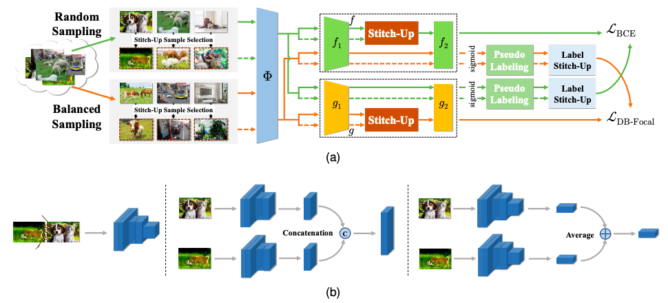

[](https://creativecommons.org/licenses/by-nc/4.0/)
[](https://arxiv.org/abs/2307.00880)
# Co-Learning Meets Stitch-Up for Noisy Multi-label Visual Recognition

[[Paper]](https://arxiv.org/abs/2307.00880)

This is the code for the paper *Co-Learning Meets Stitch-Up for Noisy Multi-label Visual Recognition* (TIP 2023).

Chao Liang<sup></sup>,&nbsp;[Zongxin Yang](https://z-x-yang.github.io/),&nbsp;[Linchao Zhu](https://ffmpbgrnn.github.io/)<sup></sup>,&nbsp;[Yi Yang](https://scholar.google.com/citations?user=RMSuNFwAAAAJ&hl=en).&nbsp;



In real-world scenarios, collected and annotated data often exhibit the characteristics of multiple classes and long-tailed distribution. Additionally, label noise is inevitable in large-scale annotations and hinders the applications of learning-based models. Although many deep learning based methods have been proposed for handling long-tailed multi-label recognition or label noise respectively, learning with noisy labels in long-tailed multi-label visual data has not been well-studied because of the complexity of long-tailed distribution entangled with multi-label correlation. To tackle such a critical yet thorny problem, this paper focuses on reducing noise based on some inherent properties of multi-label classification and long-tailed learning under noisy cases. In detail, we propose a Stitch-Up augmentation to synthesize a cleaner sample, which directly reduces multi-label noise by stitching up multiple noisy training samples. Equipped with Stitch-Up, a Heterogeneous Co-Learning framework is further designed to leverage the inconsistency between long-tailed and balanced distributions, yielding cleaner labels for more robust representation learning with noisy long-tailed data. To validate our method, we build two challenging benchmarks, named VOC-MLT-Noise and COCO-MLT-Noise, respectively. Extensive experiments are conducted to demonstrate the effectiveness of our proposed method. Compared to a variety of baselines, our method achieves superior results.

## Setup
```
conda create -n myenv python=3.7
pip install -r requirements.txt
```

## Prepare Data
Download [Pascal VOC](http://host.robots.ox.ac.uk/pascal/VOC/) 2012 and [MS COCO](https://cocodataset.org/) 2017 and put them into `./data`. Download [noisy labels](https://drive.google.com/file/d/1EC3rIuvUdomg8Qtz795FkEAiygoDpvTa/view?usp=sharing) and `tar -zxf appendix.tar.gz` into `./appendix`. The directory structure should be like the following:

```
appendix
├── coco
│   └── longtail2017
│       ├── class_freq_0.3noise.pkl
│       ├── class_freq_0.5noise.pkl
│       ├── class_freq_0.7noise.pkl
│       ├── class_freq_0.9noise.pkl
│       ├── class_split.pkl
│       ├── img_id.pkl
│       └── training_split.pkl
└── VOCdevkit
    └── longtail2012
        ├── class_freq_0.3noise.pkl
        ├── class_freq_0.5noise.pkl
        ├── class_freq_0.7noise.pkl
        ├── class_freq_0.9noise.pkl
        ├── class_split.pkl
        ├── img_id.txt
        └── training_split.pkl
```

## Training

### VOC-MLT-Noise
```
python -m tools.train configs/voc/LT_dual_resnet50.py --random_head_alpha 0.7 --balance_head_alpha 0.7 --random_tail_beta 0.1 --balance_tail_beta 0.1 --work_dir work_dirs/voc_0.5
```

### COCO-MLT-Noise
```
python -m tools.train configs/coco/LT_dual_resnet50.py --random_head_alpha 0.9 --balance_head_alpha 0.9 --work_dir work_dirs/coco_0.5
```

## Inference
### VOC-MLT-Noise
```
bash tools/dist_test.sh configs/voc/LT_dual_resnet50.py work_dirs/voc_0.5/epoch_8.pth
```

### COCO-MLT-Noise
```
bash tools/dist_test.sh configs/coco/LT_dual_resnet50.py work_dirs/coco_0.5/epoch_8.pth
```

## Pre-trained models
###  VOC-MLT-Noise-0.5

|   Backbone  |    Total   |    Head   |  Medium  |   Tail  |      Download      |
| :---------: | :------------: | :-----------: | :---------: | :---------: | :----------------: |
|  ResNet-50  |      69.67      |      67.45     |    76.70     |     66.07    |     [model](https://drive.google.com/file/d/1eGBGqB0BfjMEpXEijBot8Hg7cCM831xr/view?usp=sharing)      |

### COCO-MLT-Noise-0.5

|   Backbone  |    Total   |    Head   |  Medium  |   Tail  |      Download      |
| :---------: | :------------: | :-----------: | :---------: | :---------: | :----------------: |
|  ResNet-50  |      50.44      |      56.52     |    49.16     |     45.45    |     [model](https://drive.google.com/file/d/1jcRDj_QLybUVAM4ic_dsXBQv2t7K7l1b/view?usp=sharing)      |

## Citation
```
@article{chao2023stitchup,
  author={Liang, Chao and Yang, Zongxin and Zhu, Linchao and Yang, Yi},
  journal={IEEE Transactions on Image Processing}, 
  title={Co-Learning Meets Stitch-Up for Noisy Multi-Label Visual Recognition}, 
  year={2023},
  volume={32},
  number={},
  pages={2508-2519},
  doi={10.1109/TIP.2023.3270103}}
```

## License

This project is under the CC-BY-NC 4.0 license. See [LICENSE](LICENSE) for details.

## Acknowledgements

- [wutong16/DistributionBalancedLoss](https://github.com/wutong16/DistributionBalancedLoss)
- [open-mmlab/mmcv](https://github.com/open-mmlab/mmcv)
- [mzhaoshuai/CenterCLIP](https://github.com/mzhaoshuai/CenterCLIP)
- [FreeformRobotics/Divide-and-Co-training](https://github.com/FreeformRobotics/Divide-and-Co-training)
